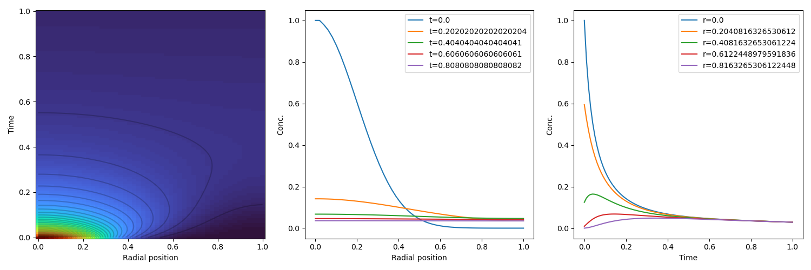

# Radial-2D-diffusion-equation
Numerically solve the radial 2D diffusion equation to simulate exciton decay in TAM experiment
For more information, including mathematical derivation see "Summary.docx"

Here is a test result with diffusion coefficient 0.5, and decay constant k=1.0 :

