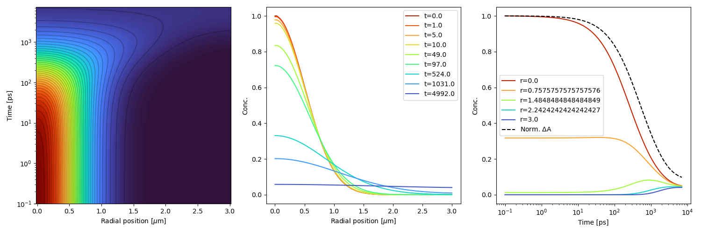
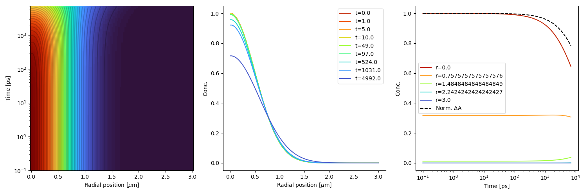
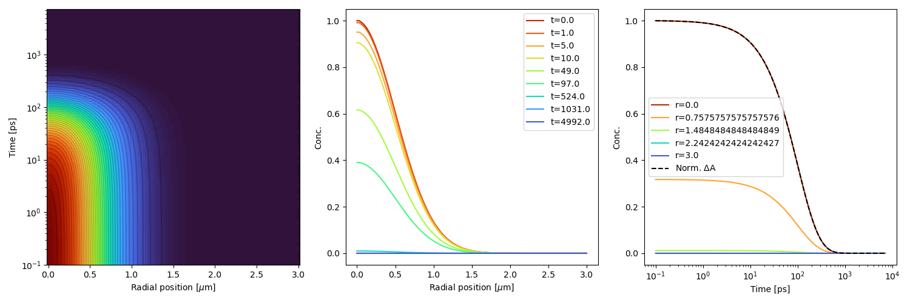
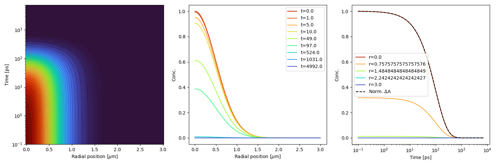

# Radial-2D-diffusion-equation
Numerically solve the radial 2D diffusion equation to simulate exciton decay in TAM experiment
For more information, including mathematical derivation see "Summary.docx"

Normalized $`a^2+b=\frac{a}{b}`$
Here are some test results with differetn values of the diffusion coefficient, D, and decay constant k:

D=5, k=0: (extremely high diffusion with no species decay to ground state, unrealistic):

D=0.1, k=0: (realistic diffusion, still no decay to ground state):

D=0, k=0.01: (no diffusion, decay to ground state within 100 ps):

D=0.1, k=0.01: (realistic diffusion, decay to ground state within 100 ps):

